# Proyecto MANEJO USSD

### by Romell Dominguez
[](https://www.romellfudi.com/)

Para manejar la comunicación ussd, hay que tener presente que la interfaz depende del SO y del fabricante.

## USSD LIBRARY

Construir una clase que extienda de los servicios de accesibilidad:

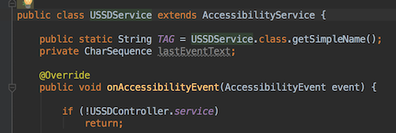

En ella capturara la información de la pantalla USSD con el SO la visualice, para ello existen 2 maneras:

* via código:

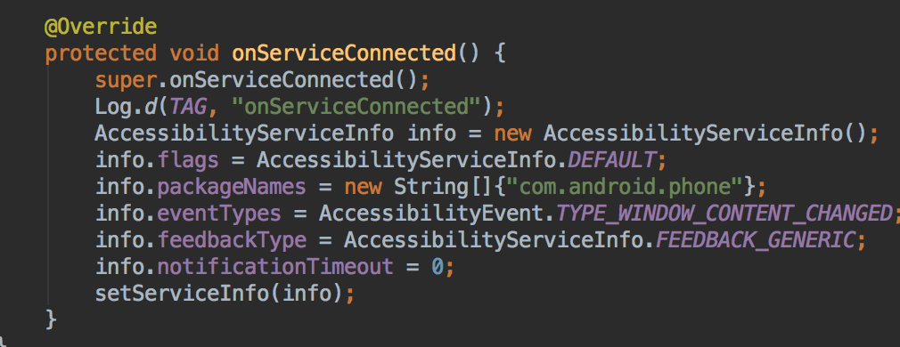

* via xml, el cual deberas vincular en el manifest de tu aplicación:

```xml
<?xml version="1.0" encoding="utf-8"?>
<accessibility-service xmlns:android="http://schemas.android.com/apk/res/android"
    android:accessibilityEventTypes
        ="typeWindowStateChanged"
    android:packageNames="com.android.phone"
    android:accessibilityFeedbackType="feedbackGeneric"
    android:accessibilityFlags="flagDefault"
    android:canRetrieveWindowContent="true"
    android:description="@string/accessibility_service_description"
    android:notificationTimeout="0"/>
```

Este es un pequeño extracto de como buscar el boton "ENVIAR" Y hacer click

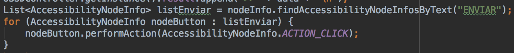

### Aplicación

En este proyecto manejo 2 flavors, uno para pruebas (development) y otro de producción (production)

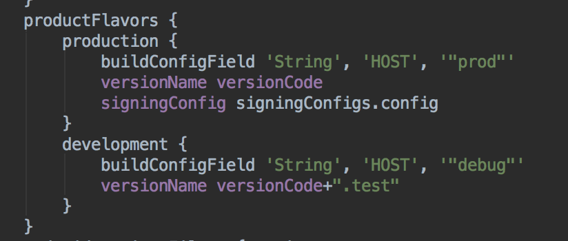

Configuramos en el archivo build.gradle, la extensión para leer librerias *.aar (la cuál crearemos y exportaremos)

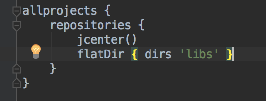

Agregamos los archivos excluyentes de las librerias para evitar conflictos

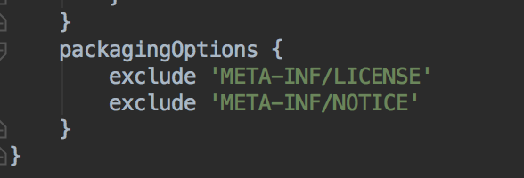

Configuramos la dependencia de la libraria ussdlibrary mediante los prefijs {debugCompile: llamar a módulo de la libreria, releaseCompile: llamar al empaquetado *.aar}

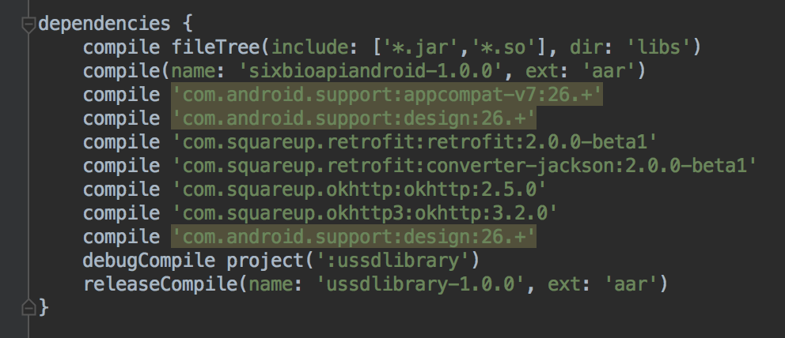

Dejamos configurado nuestro keystore con fines recreativos xD

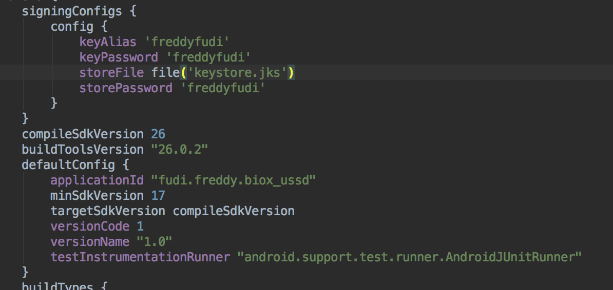

Teniendo importada las dependencias, en el manifest de la aplicación se debe escribir el servicio con los permisos necesarios

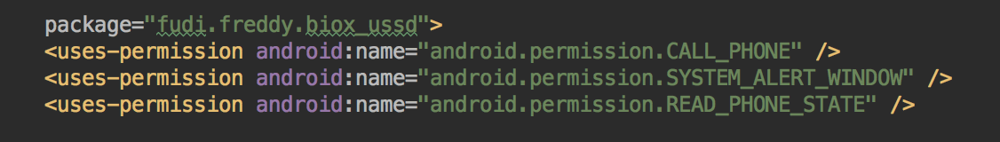

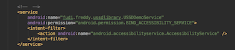

### Uso de la línea voip

En esta sección dejo las líneas claves para realizar la conexión VOIP-USSD


Una vez inicializado la llamada el servidor telcom comenzará a enviar las *famosas pantallas **ussd***

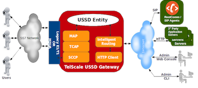
